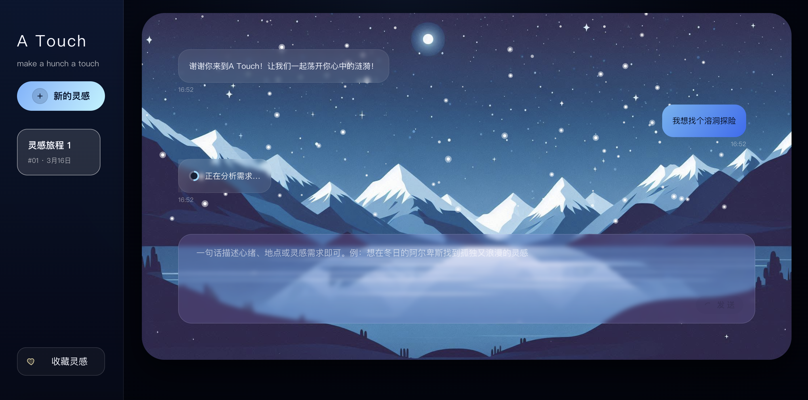
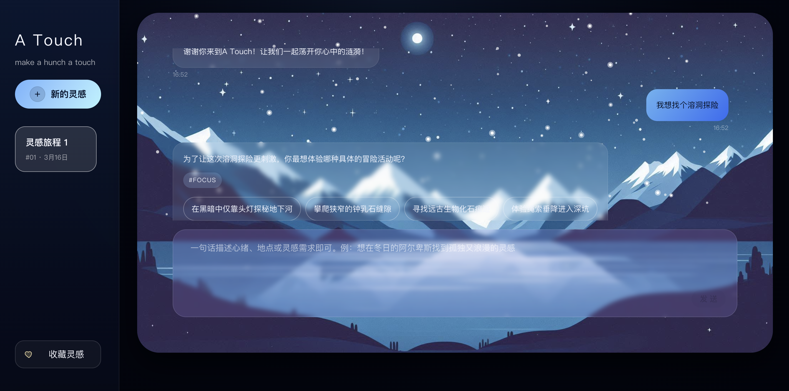
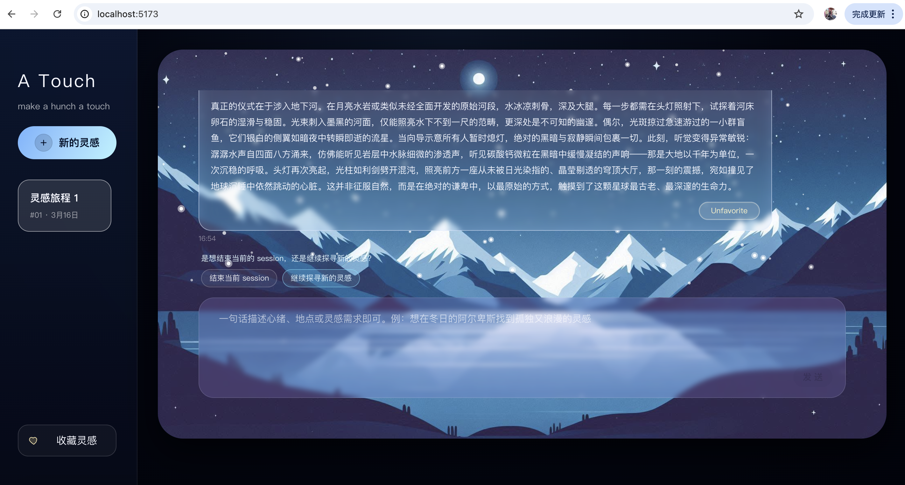
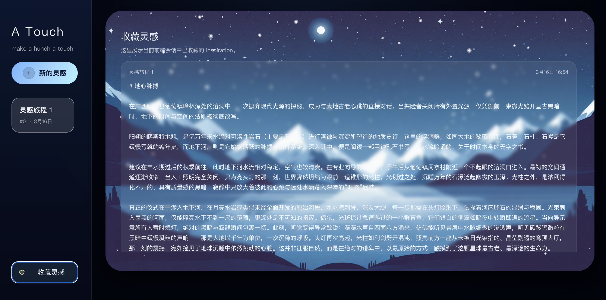
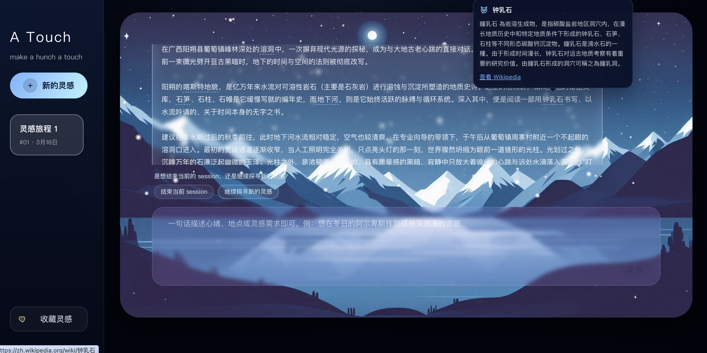

## 项目简介

想象一下时光倒回到很多年前，旅行最吸引你的是什么？是不是一种引人入胜的遐想，模糊但美好的，它在你的生活中以很多形式出现，可能是杂志上一个小方块的文本，也可能是电视上外景主持人的介绍和播报，甚至是身边小伙伴滔滔不绝的一段假期经历。在那样一个信息还未如此透明的年代，我们透过各种媒介，看世界向我们打开一角，我们好奇又渴望，我们急不可耐地想走向那样的世界。
如今我们走向一个更丰富透明的世界，一切都向我们敞开着—-只要我们指定一个目的地，就会有各种各样的信息和攻略。清晰变得触手可及，但我们心里是不是依然有一些关于旅行的向往、触动仍然是模糊的？它可能是文学段落中一个令人潸然泪下的章节，可能是艺术家作品里的一次短暂的、震颤的共鸣，也有可能是在心里细细流淌很久的淡淡的向往。
我们是不是想要一种有关感受的旅行？
这不是一个兢兢业业替你排满酒店、机票和打卡点的旅行规划器，它更像一位有点浪漫、有点狡黠、还偷偷读过很多书的文学导游。它擅长做的，不是把“去哪儿”回答得像 Excel，而是把一句模糊的心事、一点难以言说的向往，慢慢译成一段可抵达、可想象、也可真正出发的旅行灵感。

它更关心的，始终是那些不太容易被搜索框接住的问题：为什么偏偏想去那里？为什么某种风景会让人心里一震？为什么有些地方还没出发，灵魂就已经提前到站？

## 核心功能

系统会先判断用户说的究竟是不是一场旅行的召唤，再一点点拆开用户心里的线团，去辨认其中的情绪基调、旅行场景和真正想追寻的核心意象。如果表达还太朦胧，它不会急着下结论，而是继续追问，像替一句尚未写完的诗补上下一行。

当这些线索终于聚拢，系统生成的也不是一份冷静到无懈可击的标准攻略，而是一段带着温度、画面感和精神气质的旅行灵感。之后，它还会从正文里摘出那些值得多看一眼的词，接上 Wikipedia 的知识小尾巴，让一段灵感不仅好读，还能顺手牵出更广阔的世界。

## 项目打动人的地方

这个项目最迷人的地方，也许就在于它试图把“旅行”从一串消费决策里悄悄偷回来，重新放回人的感受、记忆和精神世界中。它不把用户当作一个等待被投喂行程单的消费者，而更愿意把对方看成一个正在寻找共鸣、寻找场所气质、寻找内心回声的人。

它真正打动人的，也不只是文案更漂亮，而是它想认真回答一种更深的渴望：为什么某个地方会让人向往，为什么某种风景会和某段人生互相照亮，为什么书里、电影里、历史里的土地，依然值得亲自去走一遍，吹一吹风，站一会儿，像和另一个时代交换一个眼神。

## 主要功能

### 1. 对话式旅行灵感生成
用户可以直接用自然语言描述自己想寻找的旅行感觉、文学意象或精神气质。系统会通过多轮对话，把那些原本像雾一样的愿望，慢慢收拢成一段更具体、更有画面感的旅行灵感，而不是只递来一张工整的攻略清单。

### 2. 智能追问与选项引导
当用户的表达还不够完整时，系统会围绕情绪基调、旅行场景和核心关注点继续追问。它不会粗暴地催促用户“说清楚一点”，而是给出更温柔、更具体的选项，像递来几扇半掩的门，让人更容易找到自己真正想进去的那一扇。

### 3. 结构化灵感结果
当需求收集完成后，系统会返回最终的 inspiration。前端可以通过 `is_inspiration` 和 `inspiration` 字段，清楚地区分普通聊天消息与真正的灵感结果，把它渲染成一张独立的灵感卡片，而不是让它淹没在对话气泡里。

### 4. 收藏与偏好沉淀
用户可以对喜欢的 inspiration 执行收藏和取消收藏。那些被留下来的灵感，像旅行还未发生前先悄悄折起的一张张车票，会和 session 一起保存下来，方便前端展示用户偏好，也为后续的灵感库或个人档案留出位置。

### 5. 关键词高亮与科普释义
系统会从最终灵感正文中提取关键词，记录它们在文本中的 `start` 和 `end` 位置。前端可以据此让这些词在正文里轻轻发亮，带上细细的下划线，像给文字藏了一点可被发现的暗号。

### 6. Wikipedia 知识链接
对于适合解释的关键词，系统会进一步调用 Wikipedia 获取 `summary` 和 `full_url`。于是用户在 hover 某个词时，弹出的不只是说明框，更像是一只小小的知识抽屉，被轻轻拉开后，里面藏着背景、来历和通往更远处的链接。

## 下一步的方向计划
对厘清用户需求的提问顺序配置多个策略，可基于config.json的配置调用不同策略，分别进行测试评估